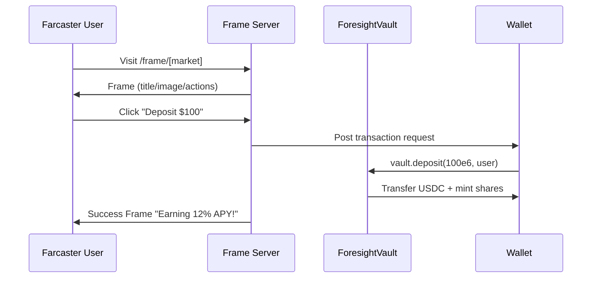

# Frame Architecture Plan

## Overview

Farcaster Frames are mini-apps embedded in Farcaster casts. Users interact with them directly in the feed — no app switching. This doc covers the full Frame flow for Foresight.

## Farcaster Frame Flow



## Frame Actions Spec

| Action | Type | Target | Data |
|--------|------|--------|------|
| Deposit $100 | `post` | `/api/deposit` | `{amount: 100e6, marketId}` |
| Preview Yield | `post` | `/api/preview` | `{marketId}` |
| Open Dashboard | `link` | `/dashboard` | — |

## Frame Routes

```
app/
├── frame/
│   └── [market]/
│       ├── page.tsx       ← Frame HTML + meta tags
│       └── loading.tsx    ← Skeleton state
└── api/
    ├── frame/
    │   └── action/
    │       └── route.ts   ← Routes button clicks
    ├── deposit/
    │   └── route.ts       ← writeContract(vault.deposit)
    └── preview/
        └── route.ts       ← readContract(previewRedeem)
```

## Frame Image Spec

- **File:** `public/yield-chart.png`
- **Dimensions:** 1200×630px (1.91:1 aspect ratio required by Farcaster)
- **Content:** "$100 → $112" bar chart with 12% APY callout
- **Format:** PNG (WebP fallback via Next.js Image optimization)

## Meta Tags (fc:frame v2)

```tsx
// app/frame/[market]/page.tsx — generateMetadata()
{
  'fc:frame': 'vNext',
  'fc:frame:image': '/yield-chart.png',
  'fc:frame:image:aspect_ratio': '1.91:1',
  'fc:frame:button:1': '🚀 Deposit $100 → Earn 12% APY',
  'fc:frame:button:1:action': 'post',
  'fc:frame:button:2': '📊 Preview Yield',
  'fc:frame:button:2:action': 'post',
  'fc:frame:button:3': '🔗 Open Dashboard',
  'fc:frame:button:3:action': 'link',
  'fc:frame:post_url': 'https://foresight-apps.vercel.app/api/frame/action',
}
```

## Security

- In production: validate `trustedData.messageBytes` via `@farcaster/hub-nodejs`
- For MVP: use `untrustedData` only (no hub verification)
- Rate limit `/api/deposit` to prevent spam

## Validation

Test every deploy at [framescan.com](https://framescan.com) before sharing.
