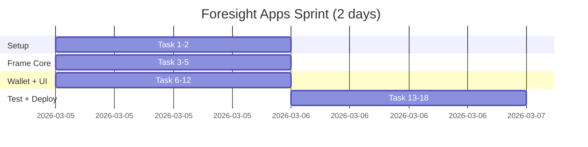

# Foresight Apps Task Tracker

**Sprint Goal:** Live Frame + "$100→$112" demo by Day 6
**Sprint:** Mar 5–6, 2026

## Progress

**0/18 tasks complete**

## Task Index

### Phase 1: Setup (Mar 5 AM)
| # | Task | Est | Status | Priority |
|---|------|-----|--------|----------|
| 1 | [Next.js 15 + Tailwind + TypeScript Setup](./01-setup/01-nextjs-init.md) | 0.5h | ⏳ | P1 |
| 2 | [Install Core Dependencies](./01-setup/02-install-deps.md) | 0.25h | ⏳ | P1 |

### Phase 2: Frame Core (Mar 5 AM)
| # | Task | Est | Status | Priority |
|---|------|-----|--------|----------|
| 3 | [Farcaster Frame Dynamic Routes](./02-frame-core/03-frame-routes.md) | 1h | ⏳ | P1 |
| 4 | [POST /api/deposit → vault.deposit](./02-frame-core/04-deposit-action.md) | 1h | ⏳ | P1 |
| 5 | [previewRedeem Display + Countdown](./02-frame-core/05-preview-display.md) | 0.5h | ⏳ | P1 |

### Phase 3: Wallet Features (Mar 5 PM)
| # | Task | Est | Status | Priority |
|---|------|-----|--------|----------|
| 6 | [Coinbase Smart Wallet Connector](./03-wallet-features/06-wallet-connector.md) | 1h | ⏳ | P1 |
| 7 | [Static "$100→$112" PNG Embed](./03-wallet-features/07-yield-image.md) | 0.5h | ⏳ | P2 |
| 8 | [Mantine Mobile-First UI](./03-wallet-features/08-mantine-ui.md) | 1h | ⏳ | P2 |
| 9 | [Telegram Bot QR Proxy](./03-wallet-features/09-telegram-proxy.md) | 1h | ⏳ | P3 |

### Phase 4: UI/UX Polish (Mar 5–6)
| # | Task | Est | Status | Priority |
|---|------|-----|--------|----------|
| 10 | [Error Boundaries + X.com Redirect](./04-ui-ux/10-error-boundaries.md) | 0.5h | ⏳ | P2 |
| 11 | [Mantine Skeletons + Loading States](./04-ui-ux/11-loading-states.md) | 0.5h | ⏳ | P2 |
| 12 | [Frame Image Optimization (WebP)](./04-ui-ux/12-image-optimization.md) | 0.25h | ⏳ | P2 |

### Phase 5: Test + Deploy (Mar 6)
| # | Task | Est | Status | Priority |
|---|------|-----|--------|----------|
| 13 | [80% Test Coverage](./05-deploy-test/13-unit-tests.md) | 2h | ⏳ | P2 |
| 14 | [Playwright E2E: Full User Flow](./05-deploy-test/14-e2e-tests.md) | 1h | ⏳ | P2 |
| 15 | [Vercel Production Deploy](./05-deploy-test/15-vercel-deploy.md) | 0.5h | ⏳ | P1 |
| 16 | [PostHog Farcaster Analytics](./05-deploy-test/16-posthog-analytics.md) | 0.5h | ⏳ | P2 |
| 17 | [Loom "$100→$112" Video Demo](./05-deploy-test/17-loom-video.md) | 1h | ⏳ | P2 |
| 18 | [Farcaster SEO Metadata](./05-deploy-test/18-seo-metadata.md) | 0.25h | ⏳ | P2 |
